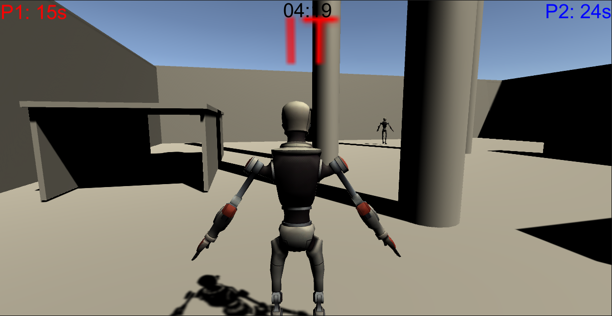

# LaserTag

Description:

A laser tag game between two robots made in Unity.

The robots shoot lasers out of their heads in order to tag eachother.

A player versus a cpu. Games last 5 minutes and scores are based off the amount of seconds that the player is not it.

Once the game is over the score is recorded on the leaderboard.

The enemy player navigates the area through a navmesh and will start shooting whenever the player is in sight.

How to run:

Built for Windows.

Navigate to the Builds folder and run DartTag.exe.
